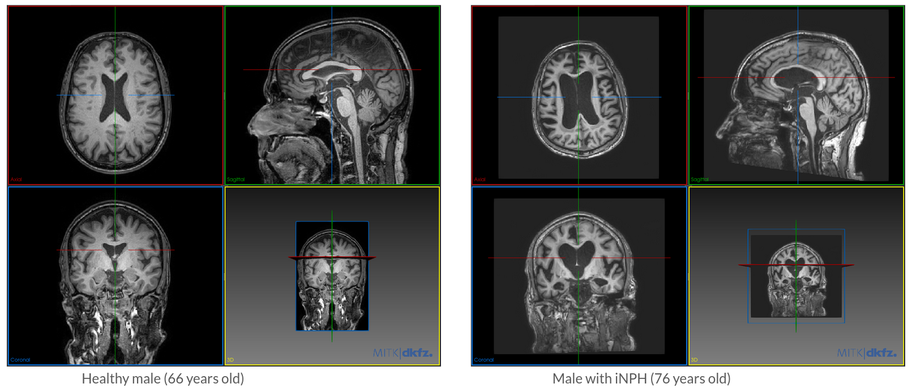
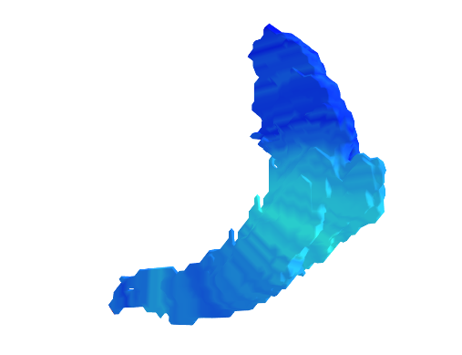

# iNPH_automatic_diagnosis
1) Master thesis project (Uppsala University 2024, MSc Data Science).
2) Scripts for papers to be published.

## What is iNPH?

iNPH (idiopathic Normal Pressure Hydrocephalus) is a neurodegenerative disease that leads to dementia. iNPH is, mainly, characterized by the dilation of the Ventricles.

## Aim of our project

The aim is twofold:

1) Develop Machine Learning models that predict the probability of a patient having iNPH.
2) Investigate the patterns on the brain that characterize iNPH.

## A few results of our study

### Volmetric approach :

We used a *FeautreTokenizer-Transformer* model, modified for tabular data. We achieved an accuracy of **94.1 %** by applying Nested Cross Validation for hyperparameter tuning on the architecture.

### Morphological approach:

Rings method :

  
  

  
  

  
  

  
  

